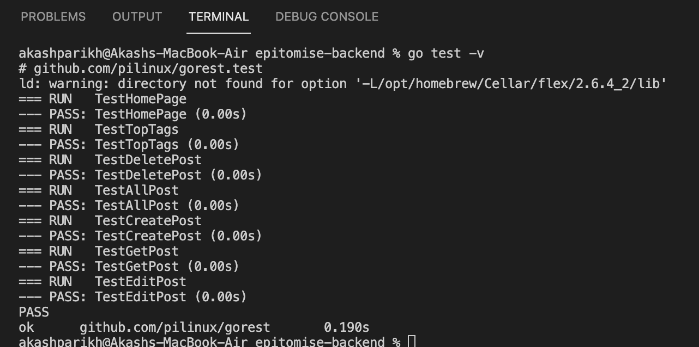
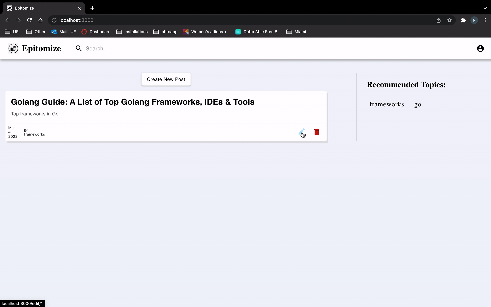
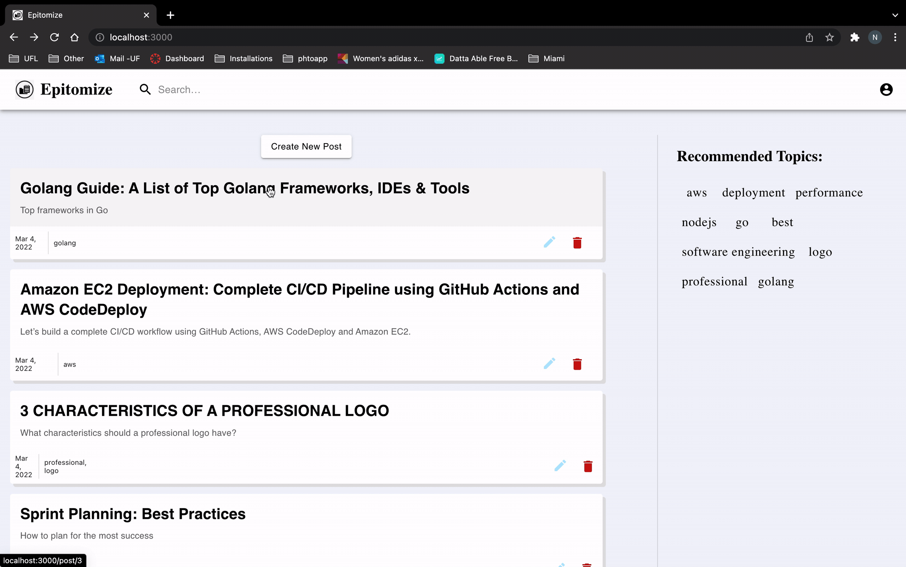
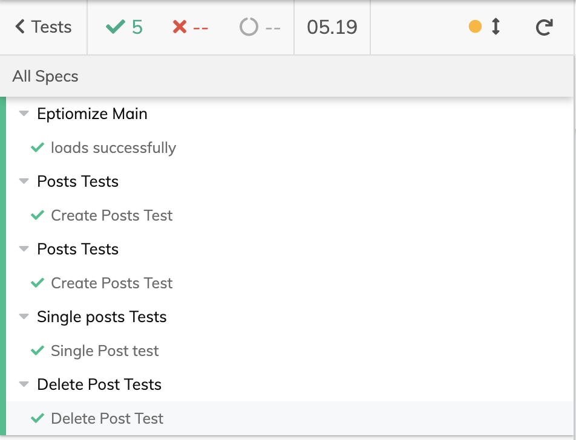

  

# Sprint 2

  

In Sprint 2 the following user stories were successfully implemented:

1. As a user, I should be able to see top 10 tags used in all posts.

* In this user story, the user has the ability to see the top 10 most used tags used in all the posts on the platform.

2. As a user, I should be able to read a post with its contents and tags.

* In this user story, the user has the ability to view the selected post. The user will be able to view the post's title, summary, content, tags and the date.

3. As a user, I should be able to edit the post.

* In this user story, the user has the ability to edit a post. The user can edit the post's title, summary and content and the user cannot edit the post's tag and type.

  

## Video Demo Link

  
  

Frontend: https://drive.google.com/file/d/1VXnWDP_RAeiLM4qFqcNMUCS51oirq35T/view?usp=sharing

  

Backend:

#### 1. Edit existing Post API
This API updates the contents of an existing Post.
Note: Tags linked with the post cannot be edited.

    PUT  /post/{POST_ID}

#### Example Request Body:

    {	
        "Type": "Blockchain", 
        "Title": "Trade on Margin with 0% Interest",
        "Summary": "Get up to 5x leverage with 0% interest ",
        "Content": "Last year we launched Margin Trading on the Blockchain.com Exchange, giving users in over 150 supported countries the ability to trade with up to 5x leverage.",
        "Linked_Post": 0,
        "Status": "Post",
    }

#### Example Responses:

    {
        "result": "OK"
    }

    {
        "result": "Bad Request"
    }

#### Status Codes:

-   **200**: Status OK
-   **400**: Bad Request
-   **500**: Internal Server Error
-   **503**: Service Unavailable 

#### 2. Get single Post API
This API returns the contents of a single Post based on the Post_ID.

    GET  /post/{POST_ID}

#### Example Response Body:

    {	
    "PostsUId": 5,
    "Type": "Post",
    "Title": "Golang structs",
    "Summary": "How to marshal a struct field that doesn’t implement the Marshaler interface",
    "Content": "We needed to marshal a Go struct to JSON and BSON (binary JSON, a serialization format developed by MongoDB), but one of the fields in my struct was an interface that needed special handling.",
    "Linked_Post": 1,
    "Status": "Draft",
    "CreatedAt": "0001-01-01T00:00:00Z",
    "UpdatedAt": "2022-02-27T17:01:32.29849-05:00",
    "TagList": null,
    "Tags": "Golang,Tech"
    }

#### Status Codes:

-   **200**: Status OK
-   **400**: Bad Request
-   **500**: Internal Server Error
-   **503**: Service Unavailable 

#### 3. Get Top 10 Tags API
This API is used to display top 10 tags to the user.

    GET  /topTags

#### Example Responses:

    {
    "TagList":["Backend","S3","Amazon Web Service","Frontend","Distributed Systems","Golang","EC2","Crypto","BlockChain","Finance","United States","Database"]
    }

#### Status Codes:

-   **200**: No error
-   **500**: Internal Server Error

## Back-end tests

To run the unit test, following command is to be used -

    go test -v

1. TestTopTags - In this test, if we can get mock top tags used in our mock db in this test case.

2. TestDeletePost  - In this test, we check id send post id is deleted from our mock db and we receive required resposnses.

3. TestAllPost - In this test, we check if we can retrieve all the posts with corresponding tags and asserts that with our mock data.

4. TestCreatePost- In this test, we check if our send mock request can create entry in our mock database.

5. TestGetPost - In this test, we are checking if the single requested post is send correctly in the response.

6. TestEditPost - In this test, we check if the request body makes an update in our mock database.

 

# Front-end Features and Usage

## Posts

  

### Edit Post Page

  

The user can select a specific post from the list of posts and edit it. The initial values of all the fields will appear in the form and the user can update them. Once the update is done, the user needs to publish and the changes will be saved. Below are the fields that can be edited.

  

- Title - User can edit the title of the post.

- Summary - Basic summary of the post can be edited.

- Tell your story - The content of the post can be edited.

  
  

### Single Post Page

  

For the post, the user can see the selected post's title, summary, the date it was created, content, and the tags associated with that post.

  

## Tags

  

### Top 10 tags

  

The list of the top ten tags is displayed on the homepage. The top ten tags are the tags that have the most number of posts associated with them. These tags get updated as posts are created or deleted or more posts get associated to a specific tag.

## Front-end tests

### Unit Tests (Using JTest)

To run the unit test, following command is to be used -

  

    npm test

To run all tests enter "a", to quit enter "q".
  

1. Create Post - We do the unit test of the Create post functionality by checking if the fields required to create the post are rendering.

2. Edit Post - We do the unit test of the Edit post functionality by checking if the fields required to edit the post are rendering.

3. Header - We do the unit test of Header component by checking if all the header values such as title are rendering.

### Functional Tests (Using Cypress)

To run the Functional tests, we run the following command -

    npx cypress open  

1. Load test- In this test, we are checking if the home page is loading correctly with the top tags and posts (if any).

2. Posts test - Here we are creating a test post in Cypress and checking if all the fields and values of the posts are rendering correctly.

3. Single post test - We are creating a single test post in Cypress and checking if all the fields and values of that post is rendering correctly on the Single post page.

4. Edit post test - For this test we are checking if the edit values of a specific post are getting updated and if all the fields and values are rendering properly on the Edit post page.

5. Delete post - In this test, we are checking if the post is correctly getting deleted.

