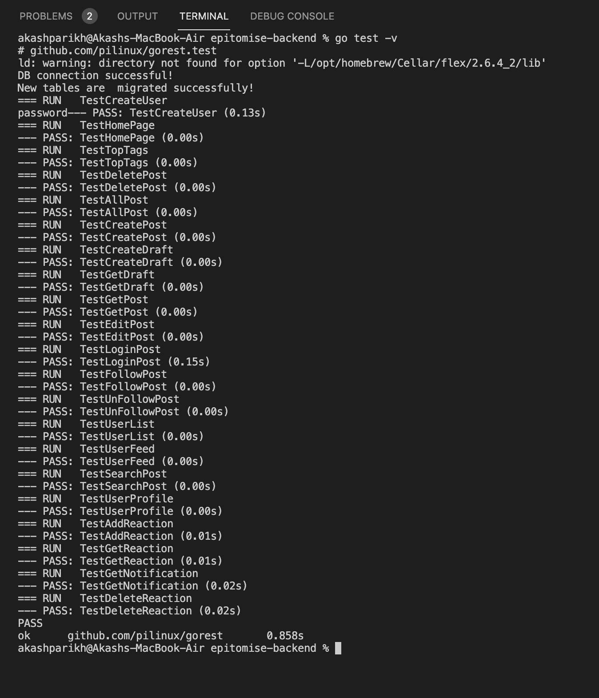
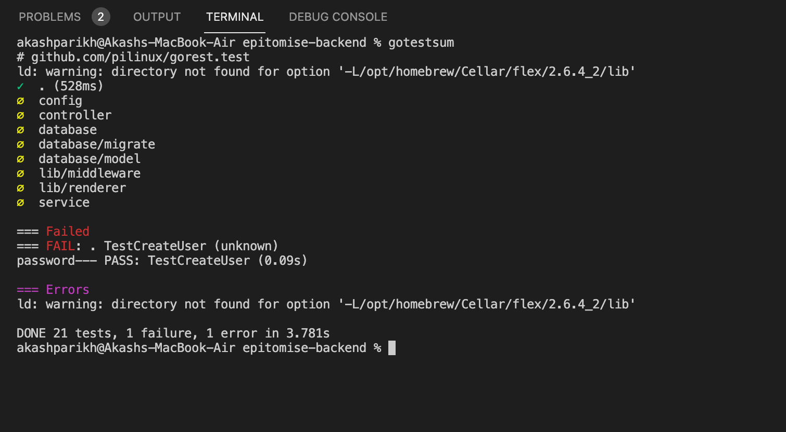

## Backend:

#### 1. Upload Image API

This API is used for upload images for user profile picture.

```
POST  /uploadImage
```
##### Header:

    Authorization: Access token
#####  Example Request Body:

```
myfile = abc.png
```

##### Example Responses:

```
{
    "message": "Successfully Uploaded File"
}
```

##### Status Codes:

-   **200**: Status OK
-   **400**: Bad Request
-   **500**: Internal Server Error
-   **503**: Service Unavailable

#### 2. Get Uploaded Image API

This API is used to get user's profile picture.

```
GET  /uploadImage
```
##### Header:

    Authorization: Access token
##### Example Responses:

```
{
    "Image_path": "{username}/{imagename}"
}
```

##### Status Codes:

-   **200**: Status OK
-   **400**: Bad Request
-   **500**: Internal Server Error
-   **503**: Service Unavailable

#### 3. Get Single Draft  API

This API is used to get user's created single draft.

```
GET  /draft/{post_id}
```
##### Header:

    Authorization: Access token
##### Example Responses:

```
{
"PostsUId": 6,
"Type": "Movie",
"Title": "New Movie",
"Summary": "test",
"Content": "test",
"Linked_Post": 0,
"Status": "1",
"CreatedAt": "2022-04-13T20:11:07.945939-04:00",
"UpdatedAt": "2022-04-13T20:11:07.945939-04:00",
"Image": "",
"TagList": [
"Sad",
"Happy"
],
"Tags": "Sad,Happy"
}
```

##### Status Codes:

-   **200**: Status OK
-   **400**: Bad Request
-   **500**: Internal Server Error
-   **503**: Service Unavailable

#### 4. Get All Draft API

This API is used to get all drafts created by the user

```
GET  /draft
```
##### Header:

    Authorization: Access token

##### Example Responses:

```
{
    "Posts": [
{
"PostsUId": 6,
"Type": "Movie",
"Title": "New Movie",
"Summary": "test",
"Content": "test",
"Linked_Post": 0,
"Status": "1",
"CreatedAt": "2022-04-13T20:11:07.945939-04:00",
"UpdatedAt": "2022-04-13T20:11:07.945939-04:00",
"Image": "",
"TagList": [
"Sad",
"Happy"
],
"Tags": "Sad,Happy"
},
        {
"PostsUId": 5,
"Type": "Book",
"Title": "New Book",
"Summary": "test",
"Content": "test",
"Linked_Post": 0,
"Status": "1",
"CreatedAt": "2022-04-13T20:11:07.945939-04:00",
"UpdatedAt": "2022-04-13T20:11:07.945939-04:00",
"Image": "",
"TagList": [
"Sad",
"Happy"
],
"Tags": "Sad,Happy"
}
}
```

##### Status Codes:

-   **200**: Status OK
-   **400**: Bad Request
-   **500**: Internal Server Error
-   **503**: Service Unavailable


#### 5. Convert Draft to Post API

This API is used to change post status from draft to post.

```
POST  /toPost/{post_id}
```
##### Header:

    Authorization: Access token

##### Example Responses:

```
{
"message" : "Draft convereted to Post"
}
```

##### Status Codes:

-   **200**: Status OK
-   **400**: Bad Request
-   **500**: Internal Server Error
-   **503**: Service Unavailable

#### 6. Get All Notifications API

This API is used to get all the notifications related to the user.

```
GET  /notification
```
##### Header:

    Authorization: Access token


##### Example Responses:

```
{
"AllNotifications": [
	{
		"NId": 8,
		"Userid": 1,
		"Message": "User {username} like your post {posttitle}",
		"Path": "/post/1",
		"CreatedAt": "2022-04-18T16:06:25.470515-04:00",
	"Read": 0
	}
  ]
}
```

##### Status Codes:

-   **200**: Status OK
-   **400**: Bad Request
-   **500**: Internal Server Error
-   **503**: Service Unavailable

#### 7. Delete Notifications API

This API is used to delete a specific notification.

```
DELETE  /notification/{notificationid}
```
##### Header:

    Authorization: Access token


##### Example Responses:

```
{
"message" : "Notification Successfuly deleted"
}
```

##### Status Codes:

-   **200**: Status OK
-   **400**: Bad Request
-   **500**: Internal Server Error
-   **503**: Service Unavailable

#### 8. Read a Single Notifications API

This API is used to change read status of given notification.

```
GET  /notification/{notificationid}
```
##### Header:

    Authorization: Access token


##### Example Responses:

```
{
"message" : "Notification Successfuly read"
}
```

##### Status Codes:

-   **200**: Status OK
-   **400**: Bad Request
-   **500**: Internal Server Error
-   **503**: Service Unavailable

#### 9. Read a All Notifications API

This API is used to change read status of given notification.

```
GET  /allnotification
```
##### Header:

    Authorization: Access token


##### Example Responses:

```
{
"message" : "All Notification Successfuly read"
}
```

##### Status Codes:

-   **200**: Status OK
-   **400**: Bad Request
-   **500**: Internal Server Error
-   **503**: Service Unavailable

## Back-end tests

To run the unit test, following command is to be used -

    go test -v

1. TestCreateDraft - In this test, we create a mock draft in our database and compare if required responses on creating a new draft is received.

2. TestGetDraft  - In this test, we get all of the drafts created by the user and compare the response with our expected response.

3. TestUserProfile -In this test, we mock and create a dummy user in database and get the user's profile using this test case.

4. TestAddReaction- In this test, we add reactions to created dummy post data in our mock db.

5. TestGetReaction - In this test, we get the list of users reacted to our given post, we receive the data from our mock db and compare it with expected list of users.

6. TestGetNotification - In this test, we retieve all notifications from our mock db and compare the notification message with expected.

7. TestDeleteReaction- In this test case, we delete one of the reaction from our mock db.

### Main_test.go



### All Test Cases



# Frontend:

## User
### Login Page

This page is used to log in the user to the application. The following information is required from the user - 
* Email Address - Email of the user
* Password - Password of the user

The user's email and password are verified on the backend and if the user gets verified then the access token is stored in the cookies which are used for authorization for other endpoints.

### Signup Page

This page is used to create a new user. The following information is required from the user -
* Email Address - Email of the user
* Password - Password of the user
* User name - User name of the user
* About - About the user
* Preferred Tags - The tags that user prefers and would like to follow.

### Follow/UnFollow a User

The list of users is visible to the current user on the sidebar as well as all the users can be seen by clicking see more suggestions. The current user can follow/unfollow any user.

## Posts
### Create New Post Page

This page asks for user information regarding creating a new post. Below information is requested -
* Title - User needs to specify the title of the post
* Summary - Basic summary of the post
* Tell your story - Here the user will specify the actual content of the post
* Type - The post can be of type blog, story, article, etc.
* Tags - Users can attach the post with tags which can help to categorize the posts and help users search the posts based on the tags.

The user can also link the post with an image. And once the user states all the information, he publishes the post by clicking on the 'Publish' button.

### Draft Post

while creating a new post, the user can save the post as a draft and publish later. The user can view all the draft posts by clicking on the drafts icon on the header. The user can edit a draft post, publish the draft post and delete the draft post. 

### View single Post Page

For the post, the user can see the post's title, summary, the date it was created, content, and the tags associated with that post.


### Edit Post Page

The user can select a specific post from the list of posts and edit it. The initial values of all the fields will appear in the form and the user can update them. Once the update is done, the user needs to publish and the changes will be saved. Below are the fields that can be edited.

* Title - User can edit the title of the post.
* Summary - Basic summary of the post can be edited.
* Tell your story - The content of the post can be edited.


### View Posts Page

The list of all posts created by the user is visible on this page. For every post, the user can see the post's title, summary, the date it was created, and the tags associated with that post. The user has the ability to edit or delete a post as well.

### Delete a Post 

While viewing all the posts lists, the option to delete a post is available. On clicking the delete icon, the post will be deleted from the database.

### View Posts as per tags

The lists of all posts belonging to a specific tag is displayed. This page is displayed when the user clicks on a specific tag which takes the user to the page which displays posts only belonging to that post. 

### Reacts to the Post

The logged in user can like a post, can view the number of likes for that post and also remove the like from the post. The user can see if they have already liked the post. 

## Tags

### View Tags Page

The list of the top ten tags is displayed on the homepage. The top ten tags are the tags that have the most number of posts associated with them.

## Profile

### Logged-in user Profile

This page gives the information regarding the logged in user such as - Username, Email id, About, Preferred tags. Here the user can even set and update a profile picture which is displayed on this page.

### Other user Profile

This page gives the information regarding the any other user which the logged in user clicks on in the home page. The information displayed is - Username, Email id, About, Preferred tags. Here the user can also see the profile picture of the other user.

## Notifications 

This page can be accessed by clicking on the notifications icon on the header tab. This page displays a list of notifications that the user can view, mark them as read and also delete the notifications. 

The type of notifications included are -
* Information about new followers about the logged in user.
* If someone has liked a post published by the logged in user.
* If a user who is followed by the logged un user creates a new post, the logged in user is notified.

 
