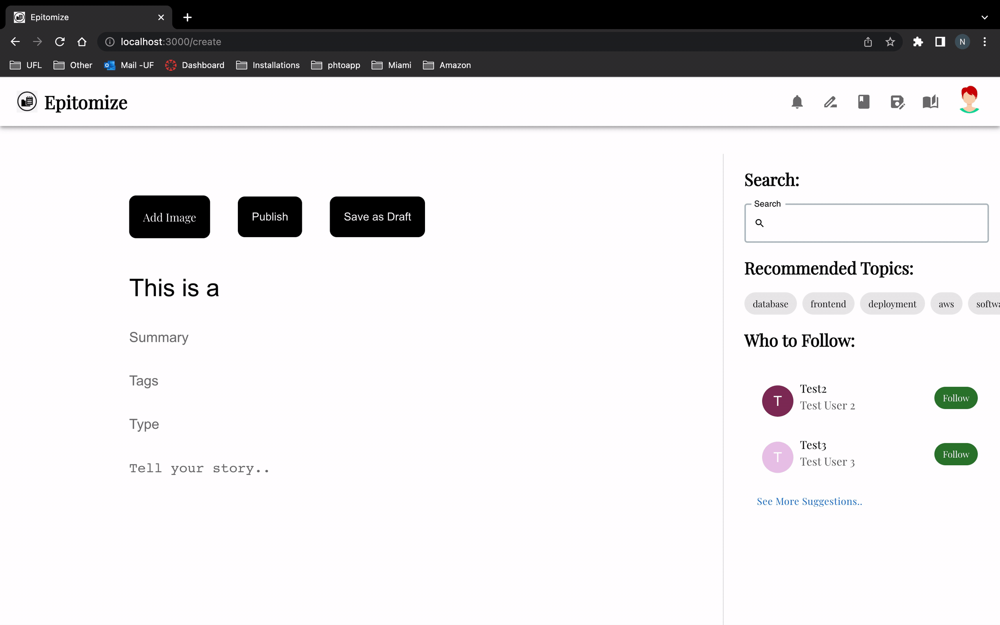
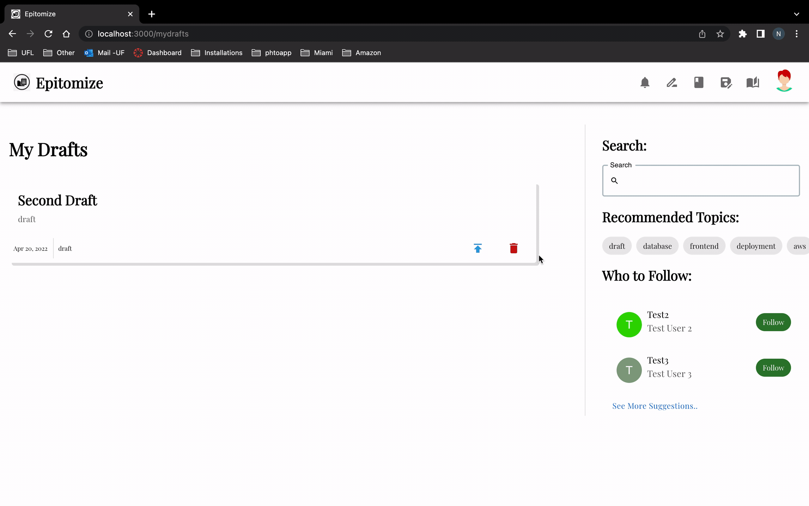
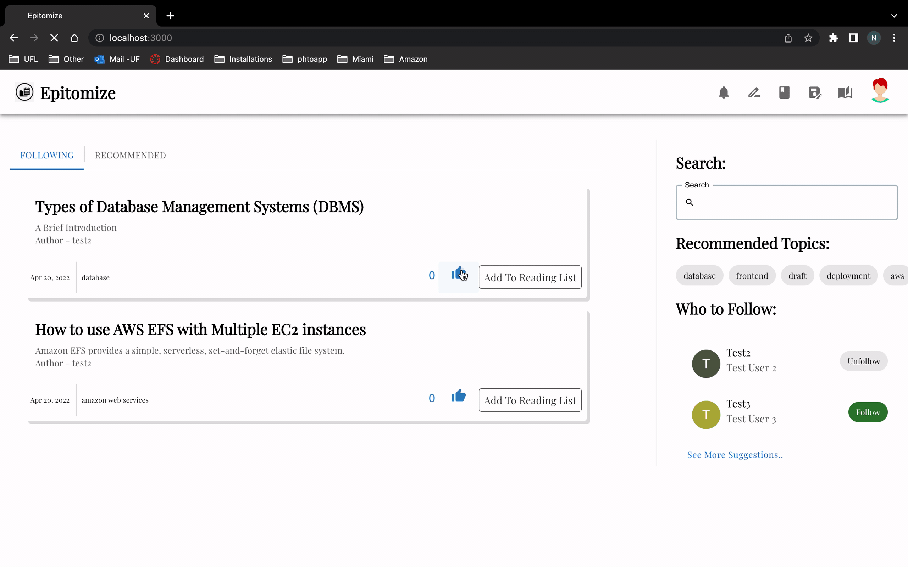
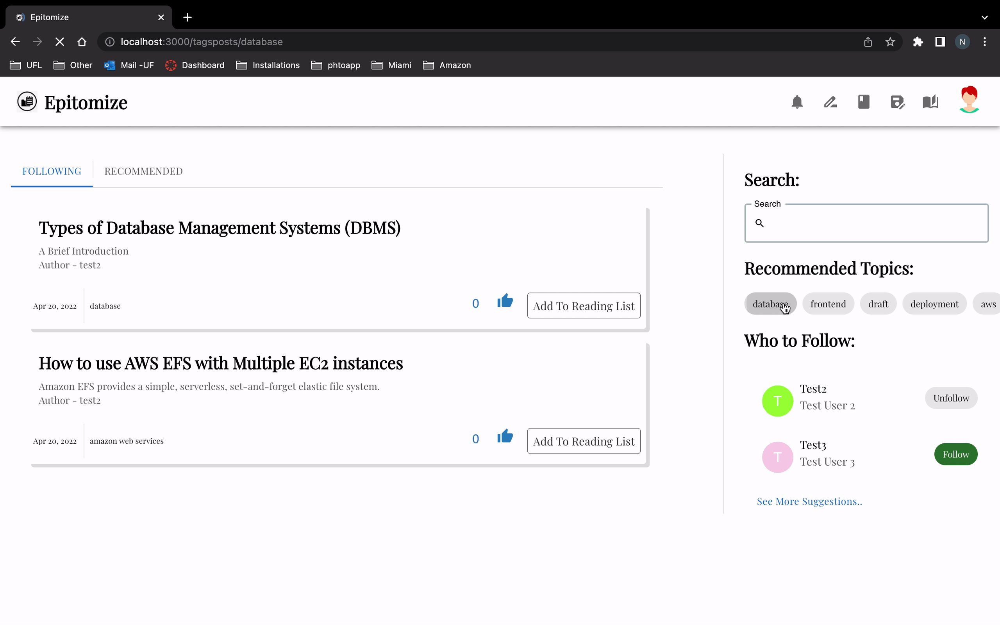
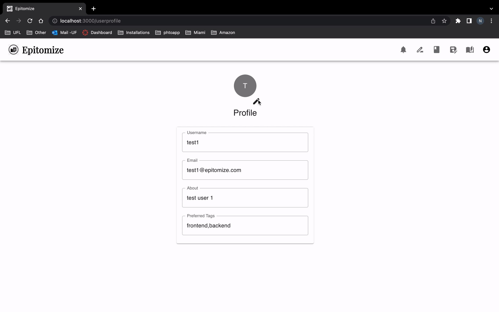
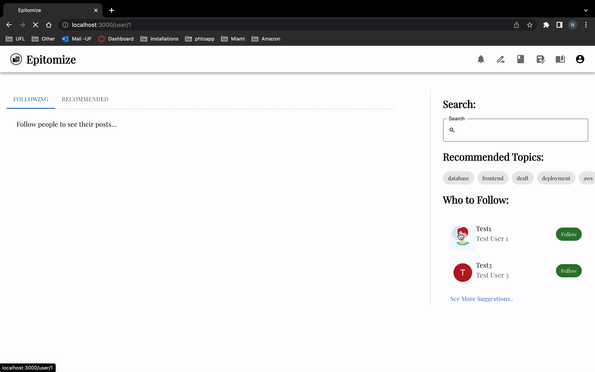
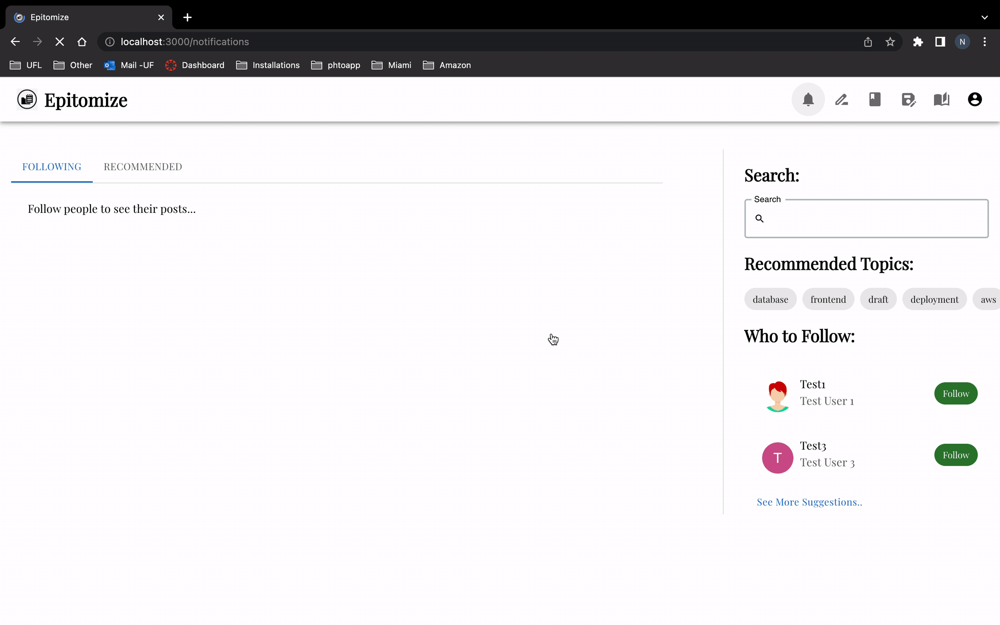

## Backend:

#### 1. Upload Image API

This API is used for upload images for user profile picture.

```
POST  /uploadImage
```
##### Header:

    Authorization: Access token
#####  Example Request Body:

```
myfile = abc.png
```

##### Example Responses:

```
{
    "message": "Successfully Uploaded File"
}
```

##### Status Codes:

-   **200**: Status OK
-   **400**: Bad Request
-   **500**: Internal Server Error
-   **503**: Service Unavailable

#### 2. Get Uploaded Image API

This API is used to get user's profile picture.

```
GET  /uploadImage
```
##### Header:

    Authorization: Access token
##### Example Responses:

```
{
    "Image_path": "{username}/{imagename}"
}
```

##### Status Codes:

-   **200**: Status OK
-   **400**: Bad Request
-   **500**: Internal Server Error
-   **503**: Service Unavailable

#### 3. Get Single Draft  API

This API is used to get user's created single draft.

```
GET  /draft/{post_id}
```
##### Header:

    Authorization: Access token
##### Example Responses:

```
{
"PostsUId": 6,
"Type": "Movie",
"Title": "New Movie",
"Summary": "test",
"Content": "test",
"Linked_Post": 0,
"Status": "1",
"ReactionCount": 3,
"CreatedAt": "2022-04-13T20:11:07.945939-04:00",
"UpdatedAt": "2022-04-13T20:11:07.945939-04:00",
"Image": "",
"TagList": [
"Sad",
"Happy"
],
"Tags": "Sad,Happy"
}
```

##### Status Codes:

-   **200**: Status OK
-   **400**: Bad Request
-   **500**: Internal Server Error
-   **503**: Service Unavailable

#### 4. Get All Draft API

This API is used to get all drafts created by the user

```
GET  /draft
```
##### Header:

    Authorization: Access token

##### Example Responses:

```
{
    "Posts": [
{
"PostsUId": 6,
"Type": "Movie",
"Title": "New Movie",
"Summary": "test",
"Content": "test",
"Linked_Post": 0,
"Status": "1",
"ReactionCount": 3,
"CreatedAt": "2022-04-13T20:11:07.945939-04:00",
"UpdatedAt": "2022-04-13T20:11:07.945939-04:00",
"Image": "",
"TagList": [
"Sad",
"Happy"
],
"Tags": "Sad,Happy"
},
        {
"PostsUId": 5,
"Type": "Book",
"Title": "New Book",
"Summary": "test",
"Content": "test",
"Linked_Post": 0,
"Status": "1",
"ReactionCount": 3,
"CreatedAt": "2022-04-13T20:11:07.945939-04:00",
"UpdatedAt": "2022-04-13T20:11:07.945939-04:00",
"Image": "",
"TagList": [
"Sad",
"Happy"
],
"Tags": "Sad,Happy"
}
}
```

##### Status Codes:

-   **200**: Status OK
-   **400**: Bad Request
-   **500**: Internal Server Error
-   **503**: Service Unavailable


#### 5. Convert Draft to Post API

This API is used to change post status from draft to post.

```
POST  /toPost/{post_id}
```
##### Header:

    Authorization: Access token

##### Example Responses:

```
{
"message" : "Draft convereted to Post"
}
```

##### Status Codes:

-   **200**: Status OK
-   **400**: Bad Request
-   **500**: Internal Server Error
-   **503**: Service Unavailable

#### 6. Get All Notifications API

This API is used to get all the notifications related to the user.

```
GET  /notification
```
##### Header:

    Authorization: Access token


##### Example Responses:

```
{
"AllNotifications": [
	{
		"NId": 8,
		"Userid": 1,
		"Message": "User {username} like your post {posttitle}",
		"Path": "/post/1",
		"CreatedAt": "2022-04-18T16:06:25.470515-04:00",
	"Read": 0
	}
  ]
}
```

##### Status Codes:

-   **200**: Status OK
-   **400**: Bad Request
-   **500**: Internal Server Error
-   **503**: Service Unavailable

#### 7. Delete Notifications API

This API is used to delete a specific notification.

```
DELETE  /notification/{notificationid}
```
##### Header:

    Authorization: Access token


##### Example Responses:

```
{
"message" : "Notification Successfuly deleted"
}
```

##### Status Codes:

-   **200**: Status OK
-   **400**: Bad Request
-   **500**: Internal Server Error
-   **503**: Service Unavailable

#### 8. Read a Single Notifications API

This API is used to change read status of given notification.

```
GET  /notification/{notificationid}
```
##### Header:

    Authorization: Access token


##### Example Responses:

```
{
"message" : "Notification Successfuly read"
}
```

##### Status Codes:

-   **200**: Status OK
-   **400**: Bad Request
-   **500**: Internal Server Error
-   **503**: Service Unavailable

#### 9. Read a All Notifications API

This API is used to change read status of given notification.

```
GET  /allnotification
```
##### Header:

    Authorization: Access token


##### Example Responses:

```
{
"message" : "All Notification Successfuly read"
}
```

##### Status Codes:

-   **200**: Status OK
-   **400**: Bad Request
-   **500**: Internal Server Error
-   **503**: Service Unavailable


#### 10. GET Posts for a Tag API
This API gets all posts that have the given tag

    GET  /post/tag/{tag_name}

##### Header:

    Authorization: Access token


#### Example Responses:

    [
        {
            "PostsUId": 1,
            "Type": "Blockchain",
            "Title": "Trade on Margin with 0% Interest",
            "Summary": "Get up to 5x leverage with 0% interest ",
            "Content": "Last year we launched Margin Trading on the Blockchain.com Exchange, giving users in over 150 supported countries the ability to trade with up to 5x leverage.",
            "Linked_Post": 0,
            "Status": "Post",
	    "ReactionCount": 3,
            "CreatedAt": "2022-04-01T13:32:05.330474-04:00",
            "UpdatedAt": "2022-04-01T13:32:05.330474-04:00",
            "TagList": null,
            "Tags": "Crypto,Bitcoin,Life"
        },
        {
            "PostsUId": 2,
            "Type": "Cricket",
            "Title": "Cricket 123",
            "Summary": "Get up to 5x leverage with 0% interest ",
            "Content": "Last year we launched Margin Trading on the Blockchain.com Exchange, giving users in over 150 supported countries the ability to trade with up to 5x leverage.",
            "Linked_Post": 0,
            "Status": "Post",
	    "ReactionCount": 3,
            "CreatedAt": "2022-04-01T13:32:37.540434-04:00",
            "UpdatedAt": "2022-04-01T13:32:37.540434-04:00",
            "TagList": null,
            "Tags": "Cricket, Life"
        },
        {
            "PostsUId": 3,
            "Type": "Football",
            "Title": "Football 123",
            "Summary": "Get up to 5x leverage with 0% interest ",
            "Content": "Last year we launched Margin Trading on the Blockchain.com Exchange, giving users in over 150 supported countries the ability to trade with up to 5x leverage.",
            "Linked_Post": 0,
            "Status": "Post",
	    "ReactionCount": 3,
            "CreatedAt": "2022-04-01T13:32:56.863487-04:00",
            "UpdatedAt": "2022-04-01T13:32:56.863487-04:00",
            "TagList": null,
            "Tags": "Football, Life"
        }
    ]


#### Status Codes:

-   **200**: Status OK
-   **400**: Bad Request
-   **500**: Internal Server Error
-   **503**: Service Unavailable


#### 11. GET Other User Profile API
This API gets the profile details of a registered User

    GET  /user/profile/{user_id}

##### Header:

    Authorization: Access token


#### Example Responses:

    {
        "Username": "user",
        "About": "About user",
	"Profile Picture": "{image_path}"
    }


#### Status Codes:

-   **200**: Status OK
-   **400**: Bad Request
-   **500**: Internal Server Error
-   **503**: Service Unavailable


#### 12. Add Post to reading list API

This API is used to add a post to the current users reading list.

```
POST  /readinglist/{post_id}
```
##### Header:

    Authorization: Access token

##### Example Responses:

```
{
"message" : "Post added to reading list"
}
```

##### Status Codes:

-   **200**: Status OK
-   **400**: Bad Request
-   **500**: Internal Server Error
-   **503**: Service Unavailable


#### 13. GET reading list of current user API
This API gets all posts that the current user has added to their reading list

    GET  /readinglist

##### Header:

    Authorization: Access token


#### Example Responses:

    [
        {
            "PostsUId": 1,
            "Type": "Blockchain",
            "Title": "Trade on Margin with 0% Interest",
            "Summary": "Get up to 5x leverage with 0% interest ",
            "Content": "Last year we launched Margin Trading on the Blockchain.com Exchange, giving users in over 150 supported countries the ability to trade with up to 5x leverage.",
            "Linked_Post": 0,
            "Status": "Post",
	    "ReactionCount": 3,
            "CreatedAt": "2022-04-01T13:32:05.330474-04:00",
            "UpdatedAt": "2022-04-01T13:32:05.330474-04:00",
            "TagList": null,
            "Tags": "Crypto,Bitcoin,Life"
        },
        {
            "PostsUId": 2,
            "Type": "Cricket",
            "Title": "Cricket 123",
            "Summary": "Get up to 5x leverage with 0% interest ",
            "Content": "Last year we launched Margin Trading on the Blockchain.com Exchange, giving users in over 150 supported countries the ability to trade with up to 5x leverage.",
            "Linked_Post": 0,
            "Status": "Post",
	    "ReactionCount": 3,
            "CreatedAt": "2022-04-01T13:32:37.540434-04:00",
            "UpdatedAt": "2022-04-01T13:32:37.540434-04:00",
            "TagList": null,
            "Tags": "Cricket, Life"
        },
        {
            "PostsUId": 3,
            "Type": "Football",
            "Title": "Football 123",
            "Summary": "Get up to 5x leverage with 0% interest ",
            "Content": "Last year we launched Margin Trading on the Blockchain.com Exchange, giving users in over 150 supported countries the ability to trade with up to 5x leverage.",
            "Linked_Post": 0,
            "Status": "Post",
	    "ReactionCount": 3,
            "CreatedAt": "2022-04-01T13:32:56.863487-04:00",
            "UpdatedAt": "2022-04-01T13:32:56.863487-04:00",
            "TagList": null,
            "Tags": "Football, Life"
        }
    ]


#### Status Codes:

-   **200**: Status OK
-   **400**: Bad Request
-   **500**: Internal Server Error
-   **503**: Service Unavailable


#### 14. Remove Post from reading list API

This API is used to remove a post from the current users reading list.

```
DELETE  /readinglist/{post_id}
```
##### Header:

    Authorization: Access token

##### Example Responses:

```
{
"message" : "Post removed from reading list"
}
```

##### Status Codes:

-   **200**: Status OK
-   **400**: Bad Request
-   **500**: Internal Server Error
-   **503**: Service Unavailable

#### 15. Add reaction to Post API

This API is used to add a reaction to a post by the current users.

```
POST  /react/{post_id}
```
##### Header:

    Authorization: Access token

##### Example Responses:

```
{
"message" : "Reaction added to Post"
}
```

##### Status Codes:

-   **200**: Status OK
-   **400**: Bad Request
-   **500**: Internal Server Error
-   **503**: Service Unavailable


#### 16. Remove reaction to Post API

This API is used to remove a previously added reaction to a post by the current users.

```
DELETE  /react/{post_id}
```
##### Header:

    Authorization: Access token

##### Example Responses:

```
{
"message" : "Reaction removed from Post"
}
```

##### Status Codes:

-   **200**: Status OK
-   **400**: Bad Request
-   **500**: Internal Server Error
-   **503**: Service Unavailable


#### 17. GET list of Users who reacted on a post API
This API gets the list of users who have reacted to the given post

    GET  /react/{post_id}

##### Header:

    Authorization: Access token


#### Example Responses:

    [
	    {
		"Username": "user1",
		"About": "About user1",
		"Profile Picture": "{image_path}"
	    },
	    {
		"Username": "user2",
		"About": "About user2",
		"Profile Picture": "{image_path}"
	    },
	    {
		"Username": "user3",
		"About": "About user3",
		"Profile Picture": "{image_path}"
	    }
    ]


#### Status Codes:

-   **200**: Status OK
-   **400**: Bad Request
-   **500**: Internal Server Error
-   **503**: Service Unavailable


## Back-end tests

To run the unit test, following command is to be used -

    go test -v

1. TestCreateDraft - In this test, we create a mock draft in our database and compare if required responses on creating a new draft is received.

2. TestGetDraft  - In this test, we get all of the drafts created by the user and compare the response with our expected response.

3. TestUserProfile -In this test, we mock and create a dummy user in database and get the user's profile using this test case.

4. TestAddReaction- In this test, we add reactions to created dummy post data in our mock db.

5. TestGetReaction - In this test, we get the list of users reacted to our given post, we receive the data from our mock db and compare it with expected list of users.

6. TestGetNotification - In this test, we retieve all notifications from our mock db and compare the notification message with expected.

7. TestDeleteReaction- In this test case, we delete one of the reaction from our mock db.

### Main_test.go


### All Test Cases


# Frontend:

## Posts

### Create New Post Page 

This page asks for user information regarding creating a new post. Below information is requested -
* Title - User needs to specify the title of the post
* Summary - Basic summary of the post
* Tell your story - Here the user will specify the actual content of the post
* Type - The post can be of type blog, story, article, etc.
* Tags - Users can attach the post with tags which can help to categorize the posts and help users search the posts based on the tags.
* Image - User can add image to the post.

The user can also link the post with an image. And once the user states all the information, he publishes the post by clicking on the 'Publish' button.


### Draft Post

while creating a new post, the user can save the post as a draft and publish later. The user can view all the draft posts by clicking on the drafts icon on the header. The user can edit a draft post, publish the draft post and delete the draft post. 

#### Create Draft



#### Publish Draft


#### Delete Draft



### Reacts to the Post

The logged in user can like a post, can view the number of likes for that post and also remove the like from the post. The user can see if they have already liked the post. 



## Tags

### View Posts as per tags

The lists of all posts belonging to a specific tag is displayed. This page is displayed when the user clicks on a specific tag which takes the user to the page which displays posts only belonging to that post. 



## Profile

### Logged-in user Profile

This page gives the information regarding the logged in user such as - Username, Email id, About, Preferred tags. Here the user can even set and update a profile picture which is displayed on this page.



### Other user Profile

This page gives the information regarding the any other user which the logged in user clicks on in the home page. The information displayed is - Username, Email id, About, Preferred tags. Here the user can also see the profile picture of the other user.



## Notifications 

This page can be accessed by clicking on the notifications icon on the header tab. This page displays a list of notifications that the user can view, mark them as read and also delete the notifications. 

The type of notifications included are -
* Information about new followers about the logged in user.
* If someone has liked a post published by the logged in user.
* If a user who is followed by the logged un user creates a new post, the logged in user is notified.



 
